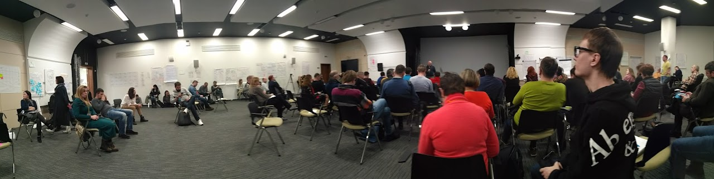

<div align="center">

# 📐 Schemata — Static Clone


**Static HTML clone of [Schemata Google Sites](https://sites.google.com/view/schemata)**

[Live Site](https://maximosovsky.github.io/schem-tech/) · [Source Tool](https://github.com/maximosovsky/google-sites-clone)



</div>

> Full offline copy of Schemata — a knowledge base on schematization methodology. Cloned with [google-sites-clone](https://github.com/maximosovsky/google-sites-clone) two-pass pipeline (SingleFile + Puppeteer).

---

## 🌐 Live

**https://maximosovsky.github.io/schem-tech/**

---

## 🛠️ How It Was Made

```bash
npx google-sites-clone https://sites.google.com/view/schemata
gsclone deploy ./clone/site --repo maximosovsky/schem-tech
```

---

## 📄 License

[Maxim Osovsky](https://www.linkedin.com/in/osovsky/). Licensed under MIT.
